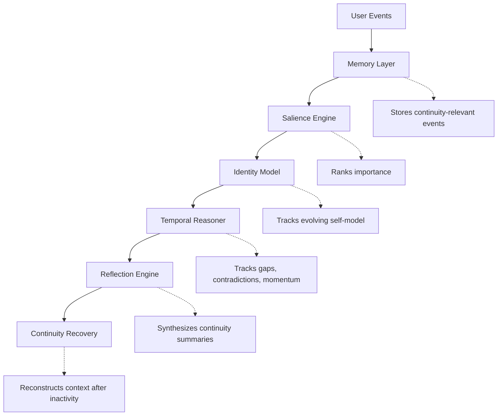

# Personal Continuity Agent

> A modular continuity engine for long-term memory, identity modeling, reflection, and temporal reasoning in AI systems.

## Why Continuity Matters

Most AI systems forget.

They operate as session-based assistants with shallow memory, limited continuity, and little understanding of long-term human evolution.

The Personal Continuity Agent explores a different direction:

- continuity instead of short-term context
- identity instead of isolated interactions
- reflection instead of retrieval-only memory
- temporal reasoning instead of stateless responses

The goal is to build systems that can maintain coherent understanding of a human across weeks, months, and years.

## Core Idea

Human intelligence is deeply temporal.

Real continuity requires:

- memory
- salience
- identity persistence
- temporal reasoning
- reflection
- recovery from context loss

This project explores continuity as a foundational primitive for intelligent systems.

## Architecture

```txt
User Events
    ↓
Memory Layer
    ↓
Salience Engine
    ↓
Identity Model
    ↓
Temporal Reasoner
    ↓
Reflection Engine
    ↓
Continuity Recovery
```



## Cognitive Layers

### Memory

Structured storage for:

- conversations
- goals
- commitments
- emotional signals
- behavioral traces
- continuity-relevant events

### Salience

Not all memories should matter equally.

The salience layer prioritizes events using:

- emotional intensity
- recurrence
- identity relevance
- goal relevance
- unresolved tension

### Identity

Tracks evolving:

- identity themes
- professional orientation
- values
- behavioral tendencies
- long-term trajectories

All identity claims are evidence-backed.

### Temporal Reasoning

Tracks continuity across time:

- recurring loops
- contradictions
- momentum decay
- continuity gaps
- unresolved commitments

### Reflection

Transforms raw events into:

- continuity summaries
- recovery briefs
- narrative synthesis
- trajectory interpretation

## Demos

### Goal Drift Demo

Detects when an important long-term goal begins decaying through missed commitments and contradictions.

Run:

```bash
PYTHONPATH=. python3 examples/goal_drift_demo/run_demo.py
```

### Identity Shift Demo

Tracks identity evolution through evidence-backed claims.

Run:

```bash
PYTHONPATH=. python3 examples/identity_shift_demo/run_demo.py
```

### Continuity Recovery Demo

Reconstructs context after a long inactivity gap.

Run:

```bash
PYTHONPATH=. python3 examples/continuity_recovery_demo/run_demo.py
```

## Quick Start

Clone the repository:

```bash
git clone https://github.com/aditya89bh/personal-continuity-agent.git
cd personal-continuity-agent
```

Create virtual environment:

```bash
python3 -m venv .venv
source .venv/bin/activate
```

Install dependencies:

```bash
pip3 install -r requirements.txt
```

Run tests:

```bash
pytest
```

Run all demos:

```bash
PYTHONPATH=. python3 run_all_demos.py
```

## Example Outputs

### Goal Drift Detection

```txt
Goal drift status: high_drift_risk
Goal drift score: 1.0
Contradictions: 1
```

### Identity Evolution

```txt
AGI systems thinker
Cognitive architecture builder
Embodied continuity researcher
```

### Continuity Recovery

```txt
Continuity gaps detected: 1
Main unresolved loop identified
Recovery brief generated
```

## Results

See:

```txt
RESULTS.md
```

for captured demo outputs, interpretations, and current system capabilities.

## Repository Structure

```txt
personal-continuity-agent/
├── continuity_core/
│   ├── memory/
│   ├── salience/
│   ├── identity/
│   ├── temporal/
│   └── reflection/
├── examples/
├── tests/
├── results/
├── docs/
└── research/
```

## Current Limitations

This is currently a research-practice prototype.

The system does not yet include:

- persistent databases
- real user ingestion pipelines
- production APIs
- authentication
- privacy tooling
- UI/dashboard
- LLM-generated reflection
- deployment infrastructure

These are intentionally deferred until the continuity architecture is more mature.

## Research Direction

The long-term direction includes:

- memory decay and forgetting
- memory compression
- contradiction repair
- longitudinal identity evolution
- multimodal continuity
- embodied continuity systems
- robotics continuity
- reflective agent architectures

## Roadmap

### Phase 1

- event memory
- salience scoring
- identity modeling
- temporal reasoning
- reflection engine
- continuity recovery

### Phase 2

- forgetting policies
- memory compression
- contradiction repair
- richer continuity synthesis

### Phase 3

- CLI continuity explorer
- visual timeline system
- persistent storage
- interactive continuity dashboard

## Strategic Positioning

This project sits at the intersection of:

- Memory Systems
- Cognitive Architectures
- AI Agents
- Long-Term Personalization
- Temporal Intelligence
- Reflective Systems
- Embodied AI

## Long-Term Vision

A future intelligent system may not be defined purely by reasoning ability, but by its capacity to maintain meaningful continuity across time.

This project explores the foundations of that idea.
